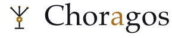
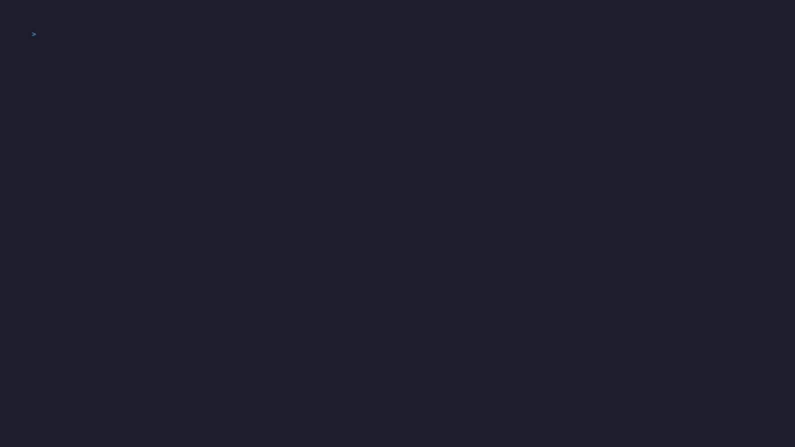
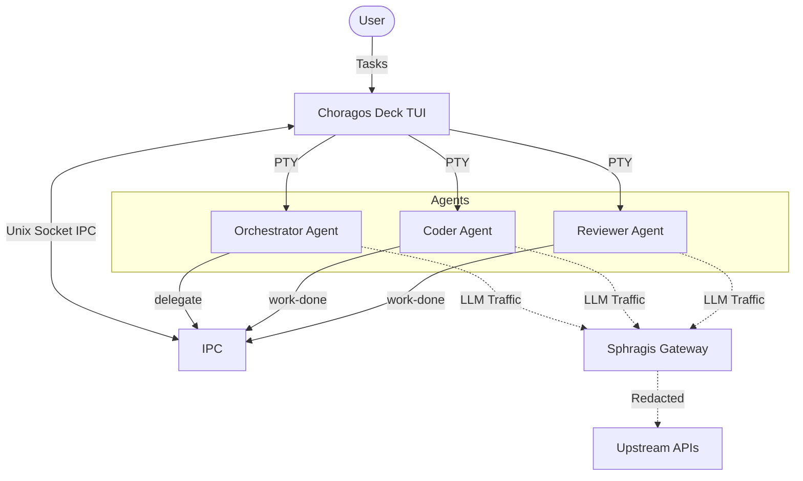

<p align="center">
  <picture>
    <source media="(prefers-color-scheme: dark)" srcset="assets/logo-wordmark-dark.svg">
    
  </picture>
</p>

<p align="center">
  <strong>
    <a href="#quick-start">Getting Started</a>
    &nbsp;&nbsp;&bull;&nbsp;&nbsp;
    <a href="CONTRIBUTING.md">Contributing</a>
    &nbsp;&nbsp;&bull;&nbsp;&nbsp;
    <a href="https://github.com/sphragis-oss/choragos/issues">Get In Touch</a>
  </strong>
</p>

<p align="center">
  <a href="https://github.com/sphragis-oss/choragos/actions/workflows/ci.yml?query=branch%3Amain">
    
  </a>
  <a href="https://github.com/sphragis-oss/choragos/releases">
    
  </a>
  <a href="LICENSE">
    
  </a>
</p>

---

Choragos is a secure multi-agent development orchestrator. It runs a team of AI coding agents in its own TUI and PTY panes, routing every agent's LLM traffic through [Sphragis](https://github.com/sphragis-oss/sphragis), the EU AI Act compliance gateway, for local PII redaction and a tamper-evident audit log.

> The name is the Greek χορηγός (*choragos*), the one who led and funded the chorus. Here it leads a chorus of agents.

<p align="center">
  
</p>

## Why Choragos?

- **Owned PTY panes:** Choragos spawns each agent in a pseudo-terminal it owns and parses (`hinshun/vt10x`), so it knows real input readiness instead of polling a status that lies. This removes the boot races that plague multiplexer-driven orchestrators.
- **Delegate/work-done protocol:** The orchestrator agent hands work to workers via a local UNIX socket with `choragos delegate --to <role> --task "..."`; workers report back with `choragos work-done`.
- **Sphragis in the data path, fail-closed:** Every worker is launched with its LLM base URL pointed at a local Sphragis gateway. If the gateway is not healthy, delegation is refused.
- **Least privilege per role (opt-in):** By default roles inherit the parent environment. Set `env_allow` on a role to switch it to an allowlist (baseline vars like `PATH`/`HOME`/`TERM` plus the names or `PREFIX_*` patterns you list), or `env_deny` to strip specific variables, so a reviewer never sees your `AWS_*` credentials.

## Architecture



## Quick Start

### Prerequisites
- Go 1.26+
- Supported CLI agents installed (e.g. `claude`, `agy`)
- [Sphragis](https://github.com/sphragis-oss/sphragis) installed in PATH

### Installation

Via Homebrew (macOS / Linux):
```bash
brew install sphragis-oss/sphragis/choragos
```

Or from source:
```bash
git clone https://github.com/sphragis-oss/choragos.git
cd choragos
make build
```

### Usage
```bash
# Write a starter .choragos.toml (roles, keybindings, UI options)
./choragos init

# Start the TUI
./choragos serve
```

Choragos will start the agents, ensure Sphragis is running, and route all traffic automatically.

The deck is a tiling window manager over the role panes, driven tmux-style behind a prefix key (default `ctrl+b`): split (`v`, `-`), move focus (`h/j/k/l`), zoom (`z`), live resize (`r`), restart a role (`R`), broadcast input to all agents (`a`), task board (`t`), scrollback search (`/`), and a help overlay (`?`). Closing a tile never kills its agent, the mouse focuses tiles and scrolls history, and the terminal bell rings when an agent blocks waiting for input. All bindings are configurable under `[keys]` in `.choragos.toml`.

## Configuration & Roles

The team is completely configurable via `.choragos.toml`. The default team looks like this:

| Role | Default agent | Job |
|------|---------------|-----|
| orchestrator | claude (opus) | plans and delegates, never implements |
| coder | claude (opus) | implements changes |
| reviewer | agy (Gemini) | reviews diffs, reports only |
| auditor | claude (sonnet) | security audit, reports only |
| release | claude (haiku) | runs the release flow after human sign-off |

Every role's agent binary and model is user-overridable.

## Development

- `make build`: Build the binary.
- `make demo`: Run the UI with placeholder cat panes (with Sphragis off).
- `make test`: Run tests with the race detector.

## Contributing

We welcome contributions! Please see [CONTRIBUTING.md](CONTRIBUTING.md) for details on how to set up your dev environment, formatting rules, and PR guidelines. Note that this project requires a Developer Certificate of Origin (DCO) sign-off on every commit.

## Community

- [Code of Conduct](CODE_OF_CONDUCT.md)
- [Governance](GOVERNANCE.md)
- [Maintainers](MAINTAINERS.md)
- [Adopters](ADOPTERS.md)

## License

Licensed under the [Apache 2.0 License](LICENSE).
